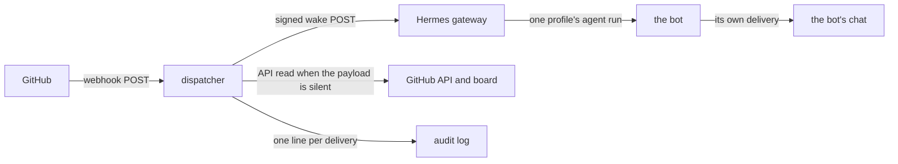

# dispatcher: systems

This is the architecture as intended: the components, what crosses between them, and which parts are settled. The product is in [PRODUCT.md](PRODUCT.md), the decisions and what they rejected are in [adrs/000-record-architecture-decisions.md](adrs/000-record-architecture-decisions.md) and the records beside it, and the questions still open are collected in [section 12](#12-settled-and-open).

## 1. The shape



## 2. Components

- **The receiver** — one HTTP server, one listener, loopback only. It is the only thing in the service that faces the network, and TLS terminates in front of it, not in it.
- **The verifier** — checks the signature over the raw body before anything parses it, against the route's own secret.
- **The router** — decides which single bot an event belongs to, from the payload, and from one board read where the payload is silent.
- **The dispatcher** — composes the wake text and posts it to that bot's gateway webhook route, signed with that route's secret.
- **The dedup cache** — delivery ids seen, with a TTL. In memory.
- **The audit log** — one line per delivery, in order, on disk.
- **The routes file** — the repositories, events and secrets this service knows. Behaviour only; no secret value lives in it.

## 3. The request path

1. GitHub posts to the public URL, which the reverse proxy forwards to the service's loopback port.
2. The receiver reads the raw body up to the body limit, then verifies `X-Hub-Signature-256` against the route's secret. Nothing is parsed before this succeeds.
3. It reads `X-GitHub-Event` and `X-GitHub-Delivery` from the headers and takes the repository and action from the parsed body.
4. The repository and event must be on the allowlist. An event that is not on it is accepted and ignored — see the response codes below.
5. The delivery id is checked against the dedup cache. A delivery already seen was dealt with; it is answered as a duplicate and nothing is dispatched.
6. The router resolves the event to exactly one bot (section 4), reading the card's board item when the payload does not carry the owning bot.
7. The dispatcher renders the wake and posts it to that bot's gateway route (section 5).
8. One line is appended to the audit log whatever happened: the ids, the decision, and the outcome.

The inbound headers are the only ones read: `X-Hub-Signature-256`, `X-GitHub-Event`, `X-GitHub-Delivery`. The endpoint path is a config value; `POST /github` is the name used here.

Response codes, chosen to match the gateway adapter's own set so that one mental model covers both hops:

- `202 Accepted` — acted on, ignored by the allowlist, filtered, or already seen as a duplicate. The body names which.
- `400 Bad Request` — the body is not the JSON the signature covered, or the envelope is incomplete.
- `401 Unauthorized` — the signature is missing or does not verify. Nothing is parsed, nothing is logged but the fact.
- `404 Not Found` — a path this service does not serve.
- `413 Payload Too Large` — the body limit was reached.
- `429 Too Many Requests` — the inbound rate limit.
- `503 Service Unavailable` — the dispatcher has no capacity (section 7). GitHub records a failed delivery and redelivers; that is the backpressure signal, and the service does not invent its own.

An event that is valid but not ours is answered `202`, never `4xx`: a 4xx makes GitHub show a failing delivery for something that is not a failure, and the failure list is then useless for spotting the real ones.

## 4. Routing — which event belongs to which bot

One place, one rule, and the same two facts the poll uses today: the card's assignee, and its board `Status`. The fleet it routes over is the four bots the queue config already names — `mama`, `meme`, `mimi`, `momo` — each with its profile and its GitHub login.

- The repository an event names must be on the allowlist; if it is not, the event concerns nobody here.
- An actor or assignee whose login is `thani-sh-<bot>` maps to profile `<bot>`. Nothing else maps to a bot, and the operator's own login maps to nobody.
- The event's action decides whether the fact is a wake at all. An assignment, a comment, a review, a review request and a finished check run are; a label edit nobody acts on is not.
- When the payload does not carry the owning bot — a comment on an unassigned card, a review request, a check run — the router reads the card's board item and uses its assignee. When that read is inconclusive, the event is not a wake for anyone: it is logged and dropped. The service never wakes more than one bot for one event, and never all four.
- The bots' profiles and logins are read from the same config the monitors read, so a new bot is a config entry and not a code change.

Events this service should accept, and why each is worth a wake:

- `issues`: assigned, unassigned, closed, reopened — the card's stage moved.
- `issue_comment` and `pull_request_review_comment`: a reply landed on a card or a review.
- `pull_request_review`: a review was submitted, including one that requests changes.
- `pull_request`: review requested, ready for review, merged.
- `check_run` and `workflow_run`: a gate finished, which is what decides whether an agent's own work shipped.
- `push` to a repository a card depends on, only if a real need appears. Defer until then.

## 5. How the wake is carried

The dispatcher composes the wake text and posts a single JSON envelope to the target bot's gateway route. The text is composed here rather than in the route template because the facts that make the reason — the card, its stage, who acts next — are what this service just resolved, and a template over the raw payload cannot know them.

```json
{
  "source": "dispatcher",
  "delivery": "<the GitHub delivery id>",
  "event": "issues",
  "action": "assigned",
  "repository": "aivara-se/dispatcher",
  "card": { "number": 1, "url": "https://github.com/aivara-se/dispatcher/issues/1" },
  "bot": "momo",
  "reason": "aivara-se/dispatcher#1 was assigned to you: \"The first pull request: the documents that define dispatcher\". It is in Todo on the board. Read the card and start it."
}
```

- **Outbound URL**: the bot's own route on the gateway — `/webhooks/<route>` on a single-profile gateway, `/p/<bot>/webhooks/<route>` where `gateway.multiplex_profiles` is enabled. One route per bot, its own secret, which is what makes "wake exactly this profile" a property of the URL and the signature rather than of the code.
- **Signature**: the dispatcher signs the request the way GitHub signs, `X-Hub-Signature-256: sha256=<hex HMAC-SHA256 over the raw body>`, so the gateway has one signature story for both hops. The adapter also documents a timestamped generic V2 signature (`X-Webhook-Signature-V2` with `X-Webhook-Timestamp`, HMAC over `<timestamp>.<body>`), which carries replay protection the plain form does not; if the route accepts it, prefer it. Which the route accepts is settled when the route is created, not here.
- **The route's own shape**: fired by `cron_job`, pointing at the bot's existing queue job, so the wake lands in the job the bot already documents rather than in a second, webhook-only instruction set. The rendered `reason` arrives as transient context for that run; the job's own prompt, skills and delivery are unchanged. Where that reference is not available, the route is an ordinary agent-mode route whose prompt is the envelope's `reason`.
- **Coalescing**: the route groups bursts by `{repository.full_name}#{card.number}`, so five rapid comments on one card are one wake with the latest event. A genuine second fact after the quiet window is a second wake.
- **Timeouts and retries**: a short request timeout, and a bounded retry with backoff for a connection error or a 5xx. A 4xx is never retried — it means the route, the secret or the envelope is wrong, and repeating it repeats the failure.
- **What the far end guarantees**: the gateway runs the agent run, or fires the job's turn, at most once per accepted delivery, and its own dedup cache drops a repeated delivery id. The dispatcher therefore does not need to know whether the agent finished, only whether the wake was accepted.

## 6. Idempotency and replay

GitHub delivers at least once, and redelivers on any non-2xx. The dispatcher is therefore idempotent at the delivery id, not at the event: `X-GitHub-Delivery` is the key, a delivery already seen is answered `202 duplicate` and dispatches nothing.

- The cache is a bounded map with a one-hour TTL, matching the TTL the gateway itself uses, so both hops forget at the same rate.
- The cache is in memory, so a restart loses it (see [ADR 007](adrs/007-persistence.md)). A redelivery after a restart can wake an agent twice. That is accepted: a duplicate wake costs one agent turn, and the agent re-reads the card, which is the source of truth. What must never happen is a wake that acts on an event it has misread — and the wake cannot, because it carries a reason, not a command.
- A delivery that ends in the dead-letter file has its dedup entry dropped, so an operator's re-dispatch after the fix is not swallowed as a duplicate.

## 7. Failure modes

- **Duplicate delivery** — answered as a duplicate; nothing dispatched.
- **Out-of-order delivery** — assumed, not prevented. Events arrive out of order and are treated as reasons to re-read, so the newest wake tells the agent to look at the card, and the card is right whatever order the wakes came in. Nothing in the service orders events, and nothing depends on their order.
- **GitHub redelivery** — the same path as a duplicate. Redelivery exists for the delivery that genuinely failed, so the dead-letter entry is the pointer an operator redelivers from.
- **Backpressure** — bounded in-flight dispatches and a bounded pending queue. A full queue answers `503`, which is honest: the fact is not lost, GitHub retries it, and the audit log names the moment the service was over capacity.
- **Outbound retries** — bounded, with backoff, for connection errors and 5xx only.
- **Dead-lettering** — after the retries are exhausted the delivery is appended to a dead-letter file with the reason, and the audit line says so. A failed wake is never silently dropped: an event nobody saw is the failure this whole service exists to prevent.
- **The gateway is down** — the same path. No retry storm, because the far end's own claim protects it, and the dead-letter file holds what was missed.
- **A restart** — the dedup cache is empty, the audit log is not. The log is reopened by a reader; the service never rewrites it.
- **Secret rotation** — the gateway holds one secret per route and GitHub holds one per webhook, so a rotation is a brief window in which signatures do not verify and deliveries fail visibly. Rotate at a quiet moment, and read GitHub's delivery list rather than assuming it went cleanly.
- **A bad route or a bad secret** — a `4xx` from the gateway is recorded and not retried. It is a configuration fault, and it is fixed by a human, not by another attempt.

## 8. Configuration and secrets

- The **routes file** is YAML and lives in this repository: the listen address, the allowlist of repositories and events, and one entry per route — its name, the bot it wakes, the gateway route and profile it posts to, and the *name* of the secret it verifies with. It is committed because it holds no secret.
- **Secret values are outside it**: an environment file the service's unit loads, or paths to files with mode `600`, owned by the service user. The routes file may name the environment variable or the path; it never holds the value.
- **Nothing secret is logged, ever** — not the value, not a prefix, not a hash of it. Payload bodies are not logged either: an audit line carries identifiers, not content, because a payload can carry anything a third party wrote.
- The one secret per route rule applies on both hops: GitHub signs the inbound POST with the route's secret, and the dispatcher signs the outbound POST with the bot's route secret on the gateway. They are different secrets for different hops.

## 9. The audit trail

One line per delivery, appended in arrival order, JSON Lines in a size-rotated file whose path is configuration. Each line carries: the time in UTC, the delivery id, the event and action, the repository, the card number when there is one, the routing decision and the bot it woke, the outbound outcome, and the response code the sender was given. Nothing else — no body, no comment text, no login beyond the actor's.

The trail answers the two questions an operator actually asks: *was this event woken, and why not if not*.

## 10. Deployment

- One long-running process on the shared VPS, beside the Hermes gateway, as a systemd user unit. Restart behaviour is `on-failure`, and the unit's environment file is where the secrets are (section 8).
- The service binds loopback only. TLS terminates at the reverse proxy in front of it, which is what exposes the endpoint to GitHub; the proxy is where the public path and the certificate live.
- The gateway's webhook adapter listens on its own port (`8644` by default) and each bot's route is created on it, bound to that bot's profile. The routes live in `~/.hermes/webhook_subscriptions.json` and are hot-reloaded, so a route change is live on the next event with no gateway restart.
- The board and issue reads go through the GitHub API with a token of its own, read-only for the board, kept outside the routes file like every other secret.
- Which port, which public path, where TLS terminates, and how the route is created are host facts of the operator's; they are recorded here once confirmed rather than assumed.

## 11. Coexistence with the poll, during migration

A bot is on one wake source at a time. Migration is per bot and is one step in each direction:

1. Create the bot's gateway route, bound to its profile with its own secret.
2. Point the repository's webhook at the dispatcher, once.
3. Move the bot: the dispatcher's route for that bot goes live, and its `queue_poll` cron entry stops being scheduled — the same commit, so no window exists in which both wake that bot.
4. Check the audit log for the bot's first real event before moving the next bot.

Rollback is the same steps in reverse, and it is the reason step 3 is one step: the poll program is not deleted, only unscheduled, so a bot can go back to a timer without a code change.

What the hourly stalled-work probe keeps doing after every bot has moved: it is the fleet's clock, it covers the one thing an event-driven service cannot see — nothing happening — and it stays.

## 12. Settled and open

Settled, and argued in the ADRs:

- Go and the standard library, one binary, no framework ([001](adrs/001-go-and-the-standard-library.md)).
- HMAC-SHA256 over the raw body, one secret per route, rejection before parsing ([002](adrs/002-github-webhook-ingestion.md)).
- The wake is a signed POST to the bot's own gateway route, carrying a reason this service composed ([003](adrs/003-waking-an-agent-through-the-gateway.md)).
- Idempotent at the delivery id, in a one-hour in-memory cache, and a failed wake is dead-lettered rather than dropped ([004](adrs/004-idempotency-and-replay.md)).
- One router, in one place, using the card's assignee and stage ([005](adrs/005-routing-an-event-to-one-bot.md)).
- A committed routes file, secrets outside it ([006](adrs/006-configuration-and-secrets.md)).
- No storage in v1 ([007](adrs/007-persistence.md)).
- A systemd user unit beside the gateway, one wake source per bot, the probe stays ([008](adrs/008-deployment-and-coexistence-with-the-poll.md)).
- The wake text is composed by the dispatcher, not by a gateway template.
- The service never writes to the board.

Open, and to be settled with the operator before the first bot moves:

- **An event on an unassigned card.** A new card in Todo is claimable by whichever bot holds nothing, which is a real reason to wake somebody and no obvious reason to wake anybody in particular. Either the router computes the claimable card and wakes that one bot by the poll's own rule, or an unassigned card waits for a sweep. Settling it decides how much of the claim rule moves into the router.
- **Whether a migrated bot's queue job keeps a slow schedule.** Removing it follows the never-both rule strictly and makes a dispatcher outage silent for that bot; keeping a monitor-mode sweep means a bot still wakes within the sweep interval when the dispatcher is down, at the cost of the timer the fleet is trying to shed. The rule as it stands is: remove it, and roll back one bot at a time.
- **Whether a card's board `Status` is needed for the events that are accepted**, or whether the assignee alone resolves them. The read exists for the events where it is not; each use of it should earn its API call.
- **One webhook per repository, or one organisation webhook.** The organisation webhook covers new repositories without a second setup step and sends events for everything; per-repository webhooks send less and must be added one by one. The allowlist makes either safe; this is the operator's call.
- **The host facts in section 10**: the public path, the TLS terminator, the ports, whether the gateway's webhook platform is enabled today, and whether profile multiplexing is on. None of these can be settled from the repository.
