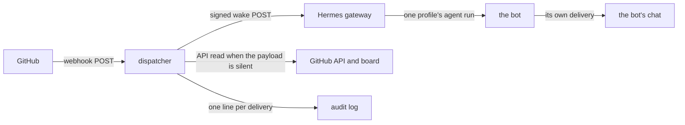

# dispatcher: systems

This is the architecture as intended: the components, what crosses between them, and which parts are settled. The product is in [PRODUCT.md](PRODUCT.md), the decisions and what they rejected are in [adrs/000-record-architecture-decisions.md](adrs/000-record-architecture-decisions.md) and the records beside it, and how each question that shaped it was settled is collected in [section 12](#12-settled).

## 1. The shape



## 2. Components

- **The receiver** — one HTTP server, one listener, loopback only. It is the only thing in the service that faces the network, and TLS terminates in front of it, not in it.
- **The verifier** — checks the signature over the raw body before anything parses it, against the route's own secret.
- **The router** — decides which single bot an event belongs to, from the payload, and from one board read where the payload is silent.
- **The dispatcher** — composes the wake text and posts it to that bot's gateway webhook route, signed with that route's secret.
- **The dedup cache** — delivery ids seen, with a TTL. In memory.
- **The audit log** — one line per delivery, in order, on disk.
- **The routes file** — the repositories, events and secrets this service knows. Behaviour only; no secret value lives in it.

## 3. The request path

1. GitHub posts to the public URL, which the reverse proxy forwards to the service's loopback port.
2. The receiver reads the raw body up to the body limit, then verifies `X-Hub-Signature-256` against the route's secret. Nothing is parsed before this succeeds.
3. It reads `X-GitHub-Event` and `X-GitHub-Delivery` from the headers and takes the repository and action from the parsed body.
4. The repository and event must be on the allowlist. An event that is not on it is accepted and ignored — see the response codes below.
5. The delivery id is checked against the dedup cache. A delivery already seen was dealt with; it is answered as a duplicate and nothing is dispatched.
6. The router resolves the event to exactly one bot (section 4), reading the card's board item when the payload does not carry the owning bot.
7. The dispatcher renders the wake and posts it to that bot's gateway route (section 5).
8. One line is appended to the audit log whatever happened: the ids, the decision, and the outcome.

The inbound headers are the only ones read: `X-Hub-Signature-256`, `X-GitHub-Event`, `X-GitHub-Delivery`. The endpoint path is a config value; `POST /github` is the name used here.

Response codes, chosen to match the gateway adapter's own set so that one mental model covers both hops:

- `202 Accepted` — acted on, ignored by the allowlist, filtered, or already seen as a duplicate. The body names which.
- `400 Bad Request` — the body is not the JSON the signature covered, or the envelope is incomplete.
- `401 Unauthorized` — the signature is missing or does not verify. Nothing is parsed, nothing is logged but the fact.
- `404 Not Found` — a path this service does not serve.
- `413 Payload Too Large` — the body limit was reached.
- `429 Too Many Requests` — the inbound rate limit.
- `503 Service Unavailable` — the dispatcher has no capacity (section 7). GitHub records a failed delivery and redelivers; that is the backpressure signal, and the service does not invent its own.

An event that is valid but not ours is answered `202`, never `4xx`: a 4xx makes GitHub show a failing delivery for something that is not a failure, and the failure list is then useless for spotting the real ones.

## 4. Routing — which event belongs to which bot

One place, one rule. The fact that decides is the card's **assignee** — the payload carries it for most events, and where it does not the router reads the card's board item for it. The card's board **stage** comes from that same read and only the claim wake below uses it: a routing decision the payload can answer never spends a board call. The fleet it routes over is the four bots the queue config already names — `mama`, `meme`, `mimi`, `momo` — each with its profile and its GitHub login.

- The repository an event names must be on the allowlist; if it is not, the event concerns nobody here.
- An actor or assignee whose login is `thani-sh-<bot>` maps to profile `<bot>`. Nothing else maps to a bot, and the operator's own login maps to nobody.
- The event's action decides whether the fact is a wake at all. An assignment, a comment, a review, a review request and a finished check run are; a label edit nobody acts on is not.
- When the payload does not carry the owning bot — a comment on an unassigned card, a review request, a check run — the router reads the card's board item and uses its assignee. When that read is inconclusive, the event is not a wake for anyone: it is logged and dropped. The service never wakes more than one bot for one event, and never all four.
- **A card with nobody on it is the claim case.** An accepted `issues` action on a card nobody holds — an `unassigned`, or a card that has just arrived (`opened`) — resolves to the *claim* wake: the router computes the claimable card from the board (the lowest-numbered card on the board, in `Todo`, unassigned, and not labelled `blocked`) and wakes the one bot whose turn it is. The claimant order is the order of the routes file's own entries (section 8) — `mama`, `meme`, `mimi`, `momo` today, which is also the fleet's login order — so the rule is configuration and not code. Once the poll is gone this is the only claim path there will be (section 11), which is why the rule is carried here deliberately instead of inherited by accident. A card that is not on the board is not the claim case, and an inconclusive read is dropped as above.
- The bots' profiles and logins are read from the same config the monitors read, so a new bot is a config entry and not a code change.
- **The read itself** is `internal/board`, built once at boot with the token the routes file names (section 8); a reference that resolves to nothing stops the process there rather than at the first silent event. One card is read through the REST API, which answers an issue and a pull request alike: a delivery that names a pull request carries the pull request's number, so the card is the issue that pull request closes — the lowest-numbered one in the same repository when it closes several. The whole board is read through the GraphQL API's project items, a page at a time; an item that is not a card in a repository is not read. A card may carry more than one login (the operator beside a bot), and the router takes the first that is one of the fleet's. A read that fails is an error and never a `no wake`: the request path answers `503` and GitHub delivers the fact again (sections 3 and 7).

Events this service should accept, and why each is worth a wake:

- `issues`: assigned, unassigned, opened, closed, reopened — a card's holder or stage moved, or a card arrived with nobody on it (the claim case above).
- `issue_comment` and `pull_request_review_comment`: a reply landed on a card or a review.
- `pull_request_review`: a review was submitted, including one that requests changes.
- `pull_request`: review requested, ready for review, merged.
- `check_run` and `workflow_run`: a gate finished, which is what decides whether an agent's own work shipped.
- `push` to a repository a card depends on, only if a real need appears. Defer until then.

## 5. How the wake is carried

The dispatcher composes the wake text and posts a single JSON envelope to the target bot's gateway route. The text is composed here rather than in the route template because the facts that make the reason — the card, its stage, who acts next — are what this service just resolved, and a template over the raw payload cannot know them.

```json
{
  "source": "dispatcher",
  "delivery": "<the GitHub delivery id>",
  "event": "issues",
  "action": "assigned",
  "repository": "aivara-se/dispatcher",
  "card": { "number": 1, "url": "https://github.com/aivara-se/dispatcher/issues/1" },
  "bot": "momo",
  "reason": "aivara-se/dispatcher#1 was assigned to you: \"The first pull request: the documents that define dispatcher\". It is in Todo on the board. Read the card and start it."
}
```

- **Which card the envelope names**: for every wake it is the card the delivery named, and for a claim wake it is the card the claim resolved — the claimable card, in its own repository, which can be one the event did not come from. The envelope's `repository` and `card` are both that card's, because the route groups bursts by the pair: a claim that borrowed the delivery's own number could be grouped with a genuine wake about it, and one of the two would be swallowed.
- **Outbound URL**: the bot's own route on the gateway, whose address is the routes file's `gateway.base_url` — `/webhooks/<route>` on a single-profile gateway, `/p/<profile>/webhooks/<route>` where `gateway.multiplex_profiles` is enabled. One route per bot, its own secret, which is what makes "wake exactly this profile" a property of the URL and the signature rather than of the code.
- **Signature**: the dispatcher signs the request the way GitHub signs, `X-Hub-Signature-256: sha256=<hex HMAC-SHA256 over the raw body>`, so the gateway has one signature story for both hops. The adapter also documents a timestamped generic V2 signature (`X-Webhook-Signature-V2` with `X-Webhook-Timestamp`, HMAC over `<timestamp>.<body>`), which carries replay protection the plain form does not; if the route accepts it, prefer it. Which form a route accepts is settled when the route is created, so it is that route's `signature_v2` switch in the routes file (section 8), and the plain form is the default.
- **The route's own shape**: fired by `cron_job`, pointing at a job the bot's wake already runs, so the wake lands in a run whose prompt, skills and delivery are the bot's own rather than in a second, webhook-only instruction set. The rendered `reason` arrives as transient per-run context; the job's own prompt, skills and delivery are unchanged. **The cutover removes the job the poll pointed at** — its programs go with their cron entries (section 11) — so a route created afterwards either fires a job kept deliberately as the wake's landing place, or is an ordinary agent-mode route whose prompt is the envelope's `reason`. Which one each bot has is decided when the routes are created and recorded in section 10, not assumed here.
- **Coalescing**: the route groups bursts by `{repository.full_name}#{card.number}`, so five rapid comments on one card are one wake with the latest event. A genuine second fact after the quiet window is a second wake.
- **Timeouts and retries**: a short request timeout, and a bounded retry with backoff for a connection error or a 5xx. A 4xx is never retried — it means the route, the secret or the envelope is wrong, and repeating it repeats the failure.
- **What the far end guarantees**: the gateway runs the agent run, or fires the job's turn, at most once per accepted delivery, and its own dedup cache drops a repeated delivery id. The dispatcher therefore does not need to know whether the agent finished, only whether the wake was accepted.

## 6. Idempotency and replay

GitHub delivers at least once, and redelivers on any non-2xx. The dispatcher is therefore idempotent at the delivery id, not at the event: `X-GitHub-Delivery` is the key, a delivery already seen is answered `202 duplicate` and dispatches nothing.

- The cache is a bounded map with a one-hour TTL, matching the TTL the gateway itself uses, so both hops forget at the same rate.
- The cache is in memory, so a restart loses it (see [ADR 007](adrs/007-persistence.md)). A redelivery after a restart can wake an agent twice. That is accepted: a duplicate wake costs one agent turn, and the agent re-reads the card, which is the source of truth. What must never happen is a wake that acts on an event it has misread — and the wake cannot, because it carries a reason, not a command.
- A delivery that ends in the dead-letter file has its dedup entry dropped, so an operator's re-dispatch after the fix is not swallowed as a duplicate.

## 7. Failure modes

- **Duplicate delivery** — answered as a duplicate; nothing dispatched.
- **Out-of-order delivery** — assumed, not prevented. Events arrive out of order and are treated as reasons to re-read, so the newest wake tells the agent to look at the card, and the card is right whatever order the wakes came in. Nothing in the service orders events, and nothing depends on their order.
- **GitHub redelivery** — the same path as a duplicate. Redelivery exists for the delivery that genuinely failed, so the dead-letter entry is the pointer an operator redelivers from.
- **Backpressure** — bounded in-flight dispatches and a bounded pending queue. A full queue answers `503`, which is honest: the fact is not lost, GitHub retries it, and the audit log names the moment the service was over capacity.
- **Outbound retries** — bounded, with backoff, for connection errors and 5xx only.
- **Dead-lettering** — after the retries are exhausted the delivery is appended to a dead-letter file with the reason, and the audit line says so. A failed wake is never silently dropped: an event nobody saw is the failure this whole service exists to prevent.
- **The gateway is down** — the same path. No retry storm, because the far end's own claim protects it, and the dead-letter file holds what was missed.
- **A restart** — the dedup cache is empty, the audit log is not. The log is reopened by a reader; the service never rewrites it.
- **Secret rotation** — the gateway holds one secret per route and GitHub holds one per webhook, so a rotation is a brief window in which signatures do not verify and deliveries fail visibly. Rotate at a quiet moment, and read GitHub's delivery list rather than assuming it went cleanly.
- **A bad route or a bad secret** — a `4xx` from the gateway is recorded and not retried. It is a configuration fault, and it is fixed by a human, not by another attempt.

## 8. Configuration and secrets

- The **routes file** is YAML and lives in this repository: the listen address, the allowlist of repositories and events, the gateway's address and whether it multiplexes profiles, the organisation and project the board read is addressed to, and one entry per route — its name, the bot it wakes, the gateway route and profile it posts to, the signature form that route accepts, and the *name* of the secret it verifies with. It is committed because it holds no secret. **The order of the `routes` entries is the claimant order** (section 4): the first route whose bot holds nothing takes a claimable card, so moving an entry is a routing change like any other and lands in the same reviewed diff.
- **Secret values are outside it**: an environment file the service's unit loads, or paths to files with mode `600`, owned by the service user. The routes file may name the environment variable or the path; it never holds the value.
- **Nothing secret is logged, ever** — not the value, not a prefix, not a hash of it. Payload bodies are not logged either: an audit line carries identifiers, not content, because a payload can carry anything a third party wrote.
- The one secret per route rule applies on both hops: GitHub signs the inbound POST with the route's secret, and the dispatcher signs the outbound POST with the bot's route secret on the gateway. They are different secrets for different hops.
- **The board's read has a token of its own**, named by the routes file's own `board:` block — `owner`, `project`, and the *name* of the token — and resolved at boot the same way a route's secrets are, so a reference that resolves to nothing stops the process rather than the first silent event. It is read-only for the board; reading the organisation's project items needs `read:project` on the token, and a card's own assignees are read from the issue itself.

## 9. The audit trail

One line per delivery, appended in arrival order, JSON Lines in a size-rotated file whose path is configuration. Each line carries: the time in UTC, the delivery id, the event and action, the repository, the card number when there is one, the routing decision and the bot it woke, the outbound outcome, and the response code the sender was given. Nothing else — no body, no comment text, no login beyond the actor's.

The trail answers the two questions an operator actually asks: *was this event woken, and why not if not*.

## 10. Deployment

Host facts, recorded here as they were confirmed; one that is not yet built says so rather than being assumed.

- **The process.** One long-running process on the shared VPS, beside the Hermes gateway, as a systemd user unit. Restart behaviour is `on-failure`, and the unit's environment file — mode `600`, owned by the service user — is where the secrets are (section 8).
- **The listen side.** The service binds loopback only: `127.0.0.1:8645`, serving `POST /github`. Both are the routes file's `listen` and `endpoint_path`, and these are the values the tree carries.
- **The public side.** TLS terminates at the reverse proxy in front of the service, which is what gives GitHub a path to post to. **That is the decision: a proxy with a certificate, not a tunnel out to a fronting service.** The host's own name, the public URL and the certificate are recorded here when the deployment card builds the proxy; as of 2026-09-30 nothing on the host terminated TLS, `sshd` was the only listener, and there was no certificate and no public path.
- **The gateway.** Its webhook adapter listens on `8644` and each bot's route is created on it, bound to that bot's profile with its own secret. Profile multiplexing is on (`gateway.multiplex_profiles: true`), so the outbound form is `/p/<bot>/webhooks/<route>` (section 5). The routes live in `~/.hermes/webhook_subscriptions.json` and are hot-reloaded, so a route change is live on the next event with no gateway restart. **The webhook platform is off today** — no subscriptions file, nothing listening on `8644` — so enabling it and creating the four routes is the deployment card's step.
- **The inbound webhook.** One organisation webhook, not one per repository (section 12): new repositories are covered with no second setup step, and the allowlist makes it safe. Creating it needs an organisation owner.
- **The board token.** The board and issue reads go through the GitHub API with a token of its own, read-only for the board, kept outside the routes file like every other secret and named by its own `board:` block (section 8). The read itself is the tree's `internal/board`; the project items need `read:project` on the token. It does not exist yet; the deployment card creates it.
- **Each route's shape** — the job it fires, or an ordinary agent-mode route (section 5) — is recorded here with the routes, because it is a property of how the host's gateway is configured rather than of this service.

## 11. The cutover

There is no coexistence to manage and no migration to run: **the poll-backed process is removed entirely before the dispatcher runs.** The two wake sources are never alive at the same time — not because one step makes the switch atomic, but because there is no longer a second one.

1. The service is finished, reviewed and green on `main`.
2. Every bot's `queue_poll` cron entry is removed, and the poll's programs are deleted with them. The hourly stalled-work probe is not the poll and stays: it is the fleet's clock, it covers the one thing an event-driven service cannot see — nothing happening — and with the poll gone it is also the only scheduled thing left that can notice a bot has gone quiet.
3. Only then is the dispatcher's unit started.

Between step 2 and the service being stable, the fleet is reached by the operator dispatching tasks by hand. That is accepted, and it is what the clean slate costs.

Nothing keeps the poll alive for the transition and nothing rolls back to it: the programs go with their cron entries, so an outage is recovered by fixing the dispatcher rather than by returning to a timer. No bot migrates one at a time, and no bot is left holding a slow schedule — there is nothing left to hold one.

## 12. Settled

Settled, and argued in the ADRs:

- Go and the standard library, one binary, no framework ([001](adrs/001-go-and-the-standard-library.md)).
- HMAC-SHA256 over the raw body, one secret per route, rejection before parsing ([002](adrs/002-github-webhook-ingestion.md)).
- The wake is a signed POST to the bot's own gateway route, carrying a reason this service composed ([003](adrs/003-waking-an-agent-through-the-gateway.md)).
- Idempotent at the delivery id, in a one-hour in-memory cache, and a failed wake is dead-lettered rather than dropped ([004](adrs/004-idempotency-and-replay.md)).
- One router, in one place, on the card's assignee — and the claim rule when a card has nobody on it ([005](adrs/005-routing-an-event-to-one-bot.md)).
- A committed routes file, secrets outside it ([006](adrs/006-configuration-and-secrets.md)).
- No storage in v1 ([007](adrs/007-persistence.md)).
- The board is read over both of GitHub's APIs — REST for one card, the GraphQL project items for the board — with a token of its own ([009](adrs/009-reading-the-board.md)).
- A systemd user unit beside the gateway, the clean-slate cutover, the probe stays ([008](adrs/008-deployment-and-the-cutover.md)).
- The wake text is composed by the dispatcher, not by a gateway template.
- The service never writes to the board.

Settled with the operator on 2026-09-30, each answered rather than assumed, each landing in the section it shapes:

- **The cutover is a clean slate.** The poll is removed entirely before the dispatcher runs — no per-bot migration, no coexistence, no rollback to the poll — which voids the premise section 11 and [ADR 008](adrs/008-deployment-and-the-cutover.md) were built on. Restated in section 11 and in that record.
- **An event on a card with nobody on it wakes the claim.** The router computes the claimable card and wakes the one bot whose turn it is, by the claimant order the routes file names — the rule the poll implements today, carried over deliberately, because with the poll retired nothing else implements a claim. In section 4, and argued in [ADR 005](adrs/005-routing-an-event-to-one-bot.md).
- **Whose card it is comes from the assignee alone** wherever the payload carries it; the board is read only where the payload is silent — a comment on an unassigned card, a review request, a check run — so each board call still has to earn itself. In section 4.
- **One organisation webhook**, not one per repository: new repositories are covered with no second setup step, and the allowlist makes it safe. It needs an organisation owner to create it. In section 10.
- **The routes file stays YAML, with one dependency**: `gopkg.in/yaml.v3`, added by the skeleton and justified in its pull request, which is the bar [ADR 001](adrs/001-go-and-the-standard-library.md) sets. The alternative — standard library only, a JSON routes file, [ADR 006](adrs/006-configuration-and-secrets.md) amended — is the one not taken. In section 8 and the README.
- **The host facts are in section 10**: the loopback port and the endpoint path, profile multiplexing on, the gateway's webhook platform still off, the reverse proxy that terminates TLS, the organisation webhook, and the board token that does not exist yet.

Nothing here is open. A question about the architecture is settled in this section and argued in an ADR; a fact about the host is recorded in section 10.
